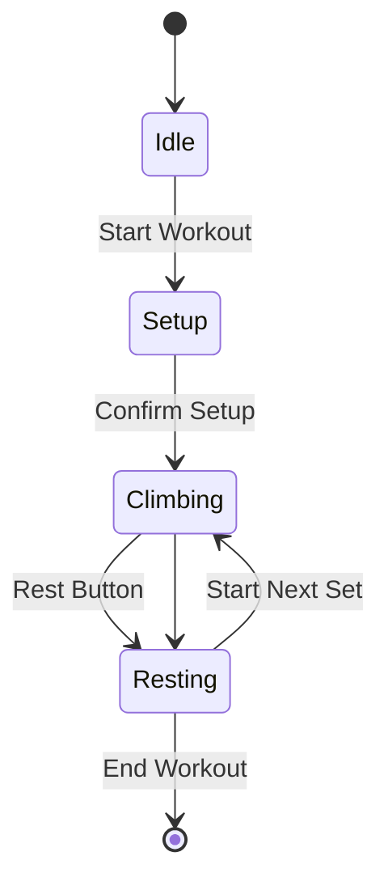
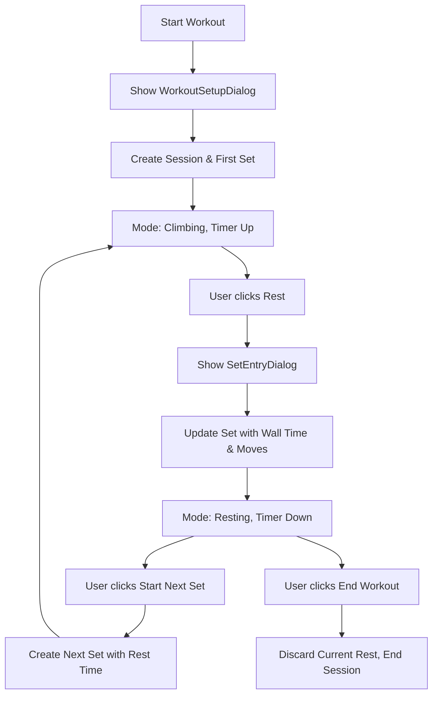
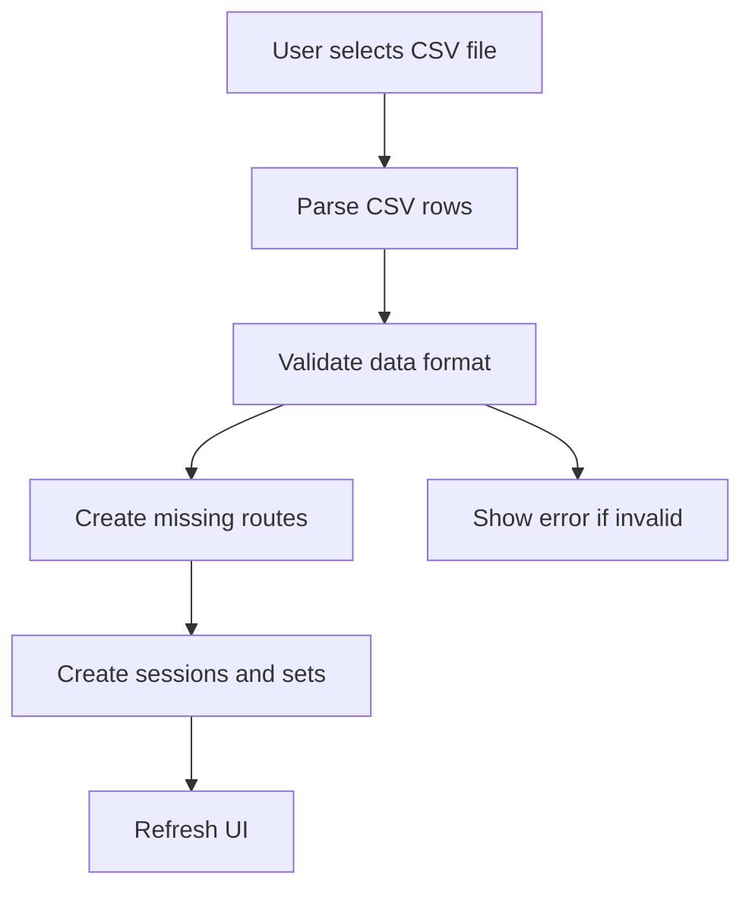

# Climb Endurance App Documentation

## Overview

Climb Endurance is a Flutter-based mobile application for tracking rock climbing workouts. It allows users to record sessions, sets, routes, and analyze performance through various charts and data visualizations. The app uses SQLite for local data storage via the sqflite package.

### Key Features
- **Workout Recording**: Real-time tracking of climbing sets with timers for wall time and rest periods.
- **Data Visualization**: Charts showing progress over time, including moves, speed, wall time, rest time, and falloff analysis.
- **Raw Data Management**: Editable tables for sessions and sets, with CSV import/export functionality.
- **Route Management**: Create and manage climbing routes with metadata.

## Architecture

The app follows a modular architecture with separation of concerns:

- **UI Layer**: Pages and widgets for user interaction.
- **Data Layer**: Models, database operations, and utilities.
- **Charts Layer**: Visualization components using fl_chart.

### Directory Structure
```
lib/
├── main.dart              # App entry point
├── src/
│   ├── charts.dart        # Chart widgets
│   ├── database.dart      # SQLite database operations
│   ├── home_shell.dart    # Bottom navigation shell
│   ├── models.dart        # Data models
│   ├── pages/             # UI pages
│   │   ├── data_page.dart     # Data visualization
│   │   ├── raw_data_page.dart # Raw data editing
│   │   └── record_page.dart   # Workout recording
│   ├── utils.dart         # Utility functions
│   └── widgets/           # Reusable widgets
│       ├── dialogs.dart       # Dialog components
│       └── session_set_table.dart # Editable set tables
```

## Data Structures

### Core Models

#### RouteEntry
Represents a climbing route.
- `id`: Unique identifier (int?)
- `name`: Route name (String)
- `wall`: Wall or location (String, default '')
- `notes`: Additional notes (String, default '')
- `holdCount`: Number of holds (int?)
- `createdAt`: Creation timestamp (DateTime)

#### WorkoutSession
Represents a workout session.
- `id`: Unique identifier (int?)
- `startedAt`: Session start time (DateTime)
- `endedAt`: Session end time (DateTime?)
- `targetRestSeconds`: Target rest duration (int)
- `notes`: Session notes (String, default '')

#### WorkoutSet
Represents a single set within a workout.
- `id`: Unique identifier (int?)
- `sessionId`: Parent session ID (int)
- `routeId`: Associated route ID (int)
- `setNumber`: Set number within session (int)
- `startedAt`: Set start time (DateTime)
- `endedAt`: Set end time (DateTime?)
- `wallTimeSeconds`: Time spent climbing (int)
- `restAfterSeconds`: Rest time before this set (int?)
- `targetRestSeconds`: Target rest duration (int)
- `movesCompleted`: Number of moves (int)
- `notes`: Set notes (String, default '')

#### SetWithRoute
Combines a WorkoutSet with route information for display.
- `set`: The WorkoutSet
- `routeName`: Name of the associated route (String)
- `sessionStartedAt`: Start time of the parent session (DateTime)

## Database Structure

The app uses SQLite with the following schema (version 2):

### Tables

#### routes
```sql
CREATE TABLE routes(
  id INTEGER PRIMARY KEY AUTOINCREMENT,
  name TEXT NOT NULL,
  wall TEXT NOT NULL DEFAULT '',
  notes TEXT NOT NULL DEFAULT '',
  hold_count INTEGER,
  created_at INTEGER NOT NULL
)
```

#### sessions
```sql
CREATE TABLE sessions(
  id INTEGER PRIMARY KEY AUTOINCREMENT,
  started_at INTEGER NOT NULL,
  ended_at INTEGER,
  target_rest_seconds INTEGER NOT NULL,
  notes TEXT NOT NULL DEFAULT ''
)
```

#### sets
```sql
CREATE TABLE sets(
  id INTEGER PRIMARY KEY AUTOINCREMENT,
  session_id INTEGER NOT NULL REFERENCES sessions(id) ON DELETE CASCADE,
  route_id INTEGER NOT NULL REFERENCES routes(id),
  set_number INTEGER NOT NULL,
  started_at INTEGER NOT NULL,
  ended_at INTEGER,
  wall_time_seconds INTEGER NOT NULL,
  rest_after_seconds INTEGER,
  target_rest_seconds INTEGER NOT NULL,
  moves_completed INTEGER NOT NULL,
  notes TEXT NOT NULL DEFAULT ''
)
```

### Relationships
- `sets.session_id` → `sessions.id` (many-to-one)
- `sets.route_id` → `routes.id` (many-to-one)
- Foreign keys enforced with `PRAGMA foreign_keys = ON`

### Database Operations
- **CRUD**: Full create, read, update, delete operations for all entities
- **Queries**: Sessions ordered by start time desc, sets ordered by set number asc
- **Migrations**: Version 2 adds nullable `ended_at` for ongoing sets

## UI Components

### Pages

#### HomeShell
Bottom navigation shell with tabs for Record, Data, and Raw Data pages.

#### RecordPage
Workout recording interface.
- Idle state: Start workout button
- Active state: Timer display, rest/climb buttons, set table
- Modes: idle, climbing, resting

#### DataPage
Data visualization with charts and filters.
- Time filters: 1 month, 9 weeks, 6 months, 1 year, custom range
- Route filter: All or specific routes
- Charts: Moves over time, Speed over time, Wall time over time, Rest time over time, Falloff charts

#### RawDataPage
Raw data editing interface.
- Collapsible sessions and routes
- Editable set tables
- CSV import functionality
- Add/edit/delete operations

### Widgets

#### SessionSetTable
Editable table for sets within a session.
- Columns: Set #, Route, Moves, Rest, Wall, Actions
- Real-time editing with focus-based persistence

#### EditableWorkoutSetRow
Individual editable row for a set.
- Dropdown for route selection
- Text fields for moves, rest, wall time
- Delete button

#### Dialogs
- WorkoutSetupDialog: Configure new workout (route, target rest)
- SetEntryDialog: Enter set details after climbing
- RouteDialog: Create/edit routes

#### Charts
- TrendChart: Multi-line time series for set-based metrics
- FalloffChart: Scatter plot of falloff vs set number
- RestFalloffChart: Scatter plot of falloff vs rest time

## Workflows

### Workout Recording Flow



### Detailed Recording Sequence



### Data Import Flow



## Charts and Plots

### Trend Charts
Display set-based progress over time with multiple lines (one per set number).

- **X-Axis**: Days since earliest session in filter range
- **Y-Axis**: Metric value (moves, speed, wall time, rest time)
- **Lines**: Each line represents a set number (e.g., line 1: all first sets)
- **Features**: Legend, date-based spacing, aligned across charts

### Falloff Charts
Analyze performance degradation within sessions.

- **FalloffChart**: Moves completed vs set number (scatter plot)
- **RestFalloffChart**: Moves completed vs rest time before set (scatter plot)
- **Calculation**: Falloff = (first_set_moves - current_set_moves) / first_set_moves

### Chart Filtering
- **Time Range**: Quick filters (1 month, etc.) or custom date range
- **Route Filter**: All routes or specific route
- **Data Inclusion**: Exclude zero/empty values where appropriate

## Key Utilities

### Formatting Functions
- `formatDuration(seconds)`: Convert seconds to "m:ss" format
- `formatSigned(seconds)`: Format with sign for countdown timers
- `parseDuration(text)`: Parse "m:ss" to seconds

### Data Helpers
- `firstWhereOrNull(list, predicate)`: Find first matching item or null

## Development Notes

### State Management
- Stateful widgets with local state for UI pages
- Database operations are async with proper error handling
- Real-time updates via setState and database queries

### Performance Considerations
- Charts filter data client-side for responsiveness
- Database queries use indexes on timestamps and IDs
- Large datasets handled via pagination in raw data view

### Testing
- Widget tests in `test/widget_test.dart`
- Manual testing for workout flows and data integrity

### Dependencies
- flutter: Core framework
- sqflite: SQLite database
- fl_chart: Charting library
- intl: Date/time formatting
- csv: CSV parsing
- path_provider: File system access

## Future Enhancements
- Cloud sync for data backup
- Advanced analytics and statistics
- Route difficulty grading system
- Workout templates and goals